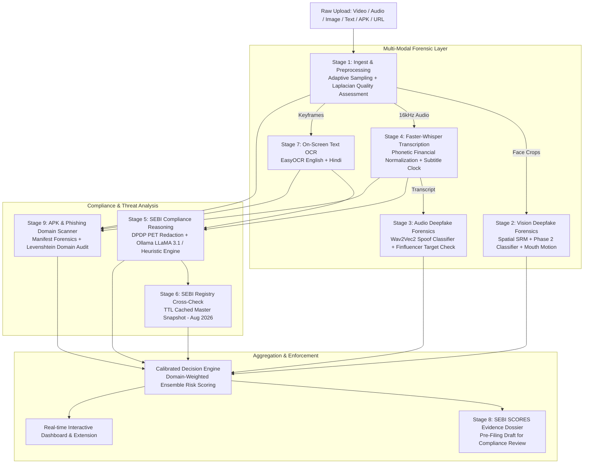

# FinGuard: Comprehensive Project Blueprint & File Directory

> **FinGuard** is a multi-modal, local-first AI forensic security platform engineered specifically for the Indian financial ecosystem. It performs automated deepfake video/audio detection, unlicensed SEBI financial advice risk assessment, rogue investment APK inspection, and phishing domain auditing, while generating structured pre-filing SEBI SCORES 2.0 evidence dossiers under DPDP Act 2023 privacy-preserving controls.

---

## Table of Contents
1. [System Architecture & 9-Stage Forensic Pipeline](#1-system-architecture--9-stage-forensic-pipeline)
2. [End-to-End Execution Flow (From Scratch)](#2-end-to-end-execution-flow-from-scratch)
3. [Exhaustive File-by-File Directory](#3-exhaustive-file-by-file-directory)
   - [3.1. Root Files & Configuration](#31-root-files--configuration)
   - [3.2. Forensic Core Stages (`src/stages/`)](#32-forensic-core-stages-srcstages)
   - [3.3. Core Support Modules (`src/`)](#33-core-support-modules-src)
   - [3.4. Verification & Operational Scripts (`scripts/`)](#34-verification--operational-scripts-scripts)
   - [3.5. Static Reference Registries (`static_data/`)](#35-static-reference-registries-static_data)
   - [3.6. Frontend Web Dashboard (`static/`)](#36-frontend-web-dashboard-static)
   - [3.7. Browser Sentinel Extension (`extension/`)](#37-browser-sentinel-extension-extension)
   - [3.8. Evaluation Benchmarks & Test Datasets (`tests/`, `test_vid/`)](#38-evaluation-benchmarks--test-datasets-tests-test_vid)
   - [3.9. Project Documentation & Master Guides](#39-project-documentation--master-guides)
4. [Calibration & Mathematical Scoring Models](#4-calibration--mathematical-scoring-models)
5. [Setup, Execution & Verification From Scratch](#5-setup-execution--verification-from-scratch)
6. [Judge Threat Defenses & Edge-Case Hardening](#6-judge-threat-defenses--edge-case-hardening)

---

## 1. System Architecture & 9-Stage Forensic Pipeline

FinGuard operates as an asynchronous, **9-Stage Sequential Forensic Pipeline** with strict sequential VRAM offloading and ephemeral sandboxing.



---

## 2. End-to-End Execution Flow (From Scratch)

1. **Client Submission**: A user uploads media (video/audio/image/APK) or enters text/URLs via the Web Dashboard or Chrome Extension.
2. **Ephemeral Sandboxing**: FastAPI generates a unique `job_id` (UUID4), creates an isolated folder in `temp/<job_id>`, and enqueues an async worker task.
3. **Stage 1 (Ingest & Input Quality Assessment)**:
   - Separates 16kHz mono audio via MoviePy with safe Windows file-handle disposal.
   - Detects human faces across scene cuts via MTCNN and extracts 15–25 optimized face crops.
   - Computes automated **Input Quality & Compression Index** via Laplacian blur variance ($\nabla^2$) and video resolution to gauge WhatsApp/web compression.
4. **Stage 2 (Vision Deepfake Detection)**:
   - Evaluates face crops using dual RGB Spatial features + 3-filter Spatial Rich Model (SRM) high-pass frequency residuals.
   - Incorporates mouth-motion viseme activity to flag static photo puppet animations.
   - Uses weighted consensus ($0.65 \times \text{Top-2 Mean} + 0.35 \times \text{Peak}$) and frees GPU memory immediately upon completion.
5. **Stage 4 (Speech Transcription)**:
   - Transcribes spoken audio using `faster-whisper-medium` with `int8` quantization.
   - Features dynamic CPU fallback memoization if Windows CUDA DLLs are missing.
   - Applies phonetic financial cleaning (*e.g. "say bee" $\rightarrow$ "SEBI"*) and timestamps all subtitles.
6. **Stage 3 (Audio Deepfake Detection)**:
   - Evaluates audio in 5-second windowed chunks via `MelodyMachine/Deepfake-Audio-Detection-V2` (Wav2Vec2).
   - Generates a per-second risk timeline track for the frontend scrubber.
   - Performs a multi-modal finfluencer impersonation check matching recognized market figures (*Nithin Kamath, Vijay Kedia, etc.*) with elevated spoof confidence.
7. **Stage 5 (SEBI Compliance Reasoning & DPDP Shield)**:
   - **Privacy-Enhancing Technology (PET)**: Redacts Indian PII (Aadhaar, PAN, phone numbers, bank accounts) before passing text to the LLM.
   - Analyzes claims against SEBI 2013/2014 regulations using local Ollama (`llama3.1:latest`).
   - Features zero-latency deterministic heuristic fallback if the LLM is unreachable or times out (>3.5s).
   - Sanitizes and logs adversarial prompt injection attempts.
8. **Stage 6 (SEBI Registry Verification)**:
   - In-memory TTL-cached lookup against `static_data/sebi_registry.json` (Snapshot: August 2026).
   - Strict format regex `r"^IN[A-Z]{1,3}[0-9]{4,12}$"` prevents false positives on generic English words.
   - Flags unverified entities, registration format errors, and name-number mismatches.
9. **Stage 7 (On-Screen OCR Text Extraction)**:
   - EasyOCR scans video keyframes or static screenshots for on-screen registration claims, WhatsApp group links, QR codes, and P&L charts.
10. **Stage 9 (APK & Phishing Domain Forensics)**:
    - **APK Mode**: Decompiles Android manifests via Androguard, flags dangerous permissions (`RECEIVE_SMS`, `SYSTEM_ALERT_WINDOW`), and checks package names against official broker whitelists.
    - **Domain Mode**: Audits URLs using Levenshtein edit distance against registered brokers and detects suspicious phishing TLDs (`.xyz`, `.top`, `.click`).
11. **Stage 8 & Aggregation (SCORES Evidence Dossier Generation)**:
    - Fuses multi-modal indicators into a calibrated risk assessment (`Safe`, `Suspicious`, `Warning`, `Critical`).
    - Compiles findings into a formal **Pre-Filing SEBI SCORES 2.0 Evidence Dossier** for human compliance review.
    - Purges temporary files in `temp/<job_id>` immediately in the `finally:` block.

---

## 3. Exhaustive File-by-File Directory

```
fintech/
├── .env / .env.example              # Environment secrets & host bindings
├── config.yaml                      # Centralized configuration & thresholds
├── requirements.txt                 # Pinned dependencies
├── app.py                           # FastAPI application & API router
├── model.py                         # Root model import shim
├── DOCUMENTATION.md                 # Complete technical specification
├── HACKATHON_GUIDE.md               # Judge defense & presentation manual
├── TEAM_ONBOARDING_GUIDE.md         # Developer onboarding & setup guide
├── README.md                        # Project landing documentation
├── progress1.md                     # Comprehensive architecture blueprint
├── src/
│   ├── __init__.py                  # Python package marker
│   ├── config.py                    # Typed YAML config loader
│   ├── model.py                     # HybridDeepfakeDetector PyTorch neural network
│   ├── backup_api.py                # Optional Sightengine cloud fallback adapter
│   └── stages/
│       ├── __init__.py
│       ├── stage1_ingest.py         # Ingest, face sampling & Laplacian quality index
│       ├── stage2_vision.py         # Spatial + SRM frequency deepfake detector
│       ├── stage3_audio.py          # Wav2Vec2 acoustic spoof & impersonation check
│       ├── stage4_transcription.py  # Faster-Whisper + financial phonetic cleaner
│       ├── stage5_llm.py            # SEBI compliance reasoning & DPDP PET shield
│       ├── stage6_registry.py       # SEBI registry cached cross-check (Aug 2026)
│       ├── stage7_ocr.py            # EasyOCR on-screen visual text extraction
│       ├── stage8_report.py         # SEBI SCORES 2.0 pre-filing evidence dossier
│       └── stage9_apk_domain.py     # APK manifest audit & Levenshtein domain scanner
├── scripts/
│   ├── audit_hardcoded.py           # Static scan asserting zero hardcoded secrets
│   ├── download_models.py           # Pre-downloads model weights to cache
│   ├── e2e_system_test.py           # 7-point live end-to-end API stress test
│   ├── generate_sample.py           # Generates synthetic multi-modal test media
│   ├── run_folder_test.py           # Batch folder benchmark harness
│   ├── self_test.py                 # 13-point unit & integration regression suite
│   ├── sync_sebi_registry.py        # Standalone SEBI master sync daemon & CLI
│   └── verify_all_models.py         # Isolated model memory & VRAM benchmark
├── static_data/
│   ├── sebi_registry.json           # Offline SEBI master database snapshot (Aug 2026)
│   └── broker_apk_whitelist.json    # White-listed broker packages & certificates
├── static/
│   ├── index.html                   # Modern glassmorphic web dashboard UI
│   ├── legacy-index.html            # Reference legacy UI
│   ├── css/
│   │   ├── app.css                  # Component styling & responsive layouts
│   │   └── core.css                 # HSL color tokens, typography & animations
│   └── js/
│       ├── api.js                   # Client-side HTTP transport & job polling
│       ├── dom.js                   # DOM helper selectors & event bindings
│       ├── main.js                  # Main UI controller & media playback binding
│       ├── model.js                 # UI view model transformer & evidence builder
│       └── stages.js                # 9-stage pipeline catalogue & status stepper
├── extension/
│   ├── manifest.json                # Chrome Extension Manifest V3 configuration
│   ├── background.js                # Background service worker & context menus
│   ├── content.js                   # In-page toast overlays & link scanners
│   ├── popup.html                   # Extension popup UI
│   ├── popup.css                    # Popup styling
│   └── popup.js                     # Popup quick-scan logic
└── tests/
    ├── test_results.csv             # Stored batch evaluation CSV results
    └── test_verification.py         # Unit tests for model pipelines
```

---

### 3.1. Root Files & Configuration

#### `config.yaml`
- **Role**: Master centralized configuration file for the entire project.
- **Key Contents**:
  - `hardware`: Device selection (`cuda` / `cpu`), mixed precision settings, and thread allocations.
  - `thresholds`: `vision_fake_threshold` (0.5), `audio_fake_threshold` (0.5), `composite_scam_threshold` (0.5), `llm_risk_auto_flag_threshold` (0.45), `impersonation_audio_threshold` (0.45), `ocr_min_confidence` (0.15), `apk_domain_levenshtein_max_dist` (3).
  - `vision` / `audio`: Early-exit thresholds, consensus blending weights (`consensus_top_weight: 0.65`).
  - `pipeline`: Stage-specific parameters (model paths, compute types, LLM timeouts, registry paths).

#### `app.py`
- **Role**: Primary FastAPI backend server exposing REST endpoints, asynchronous job queues, and static web serving.
- **Key Endpoints**:
  - `POST /api/jobs`: Submits video/audio files to the background 9-stage pipeline.
  - `GET /api/jobs/{job_id}`: Polls real-time progress and retrieves complete forensic findings.
  - `POST /api/scan/text`: Scans text/transcripts for SEBI compliance and phishing links.
  - `POST /api/scan/audio`: Fast audio spoof & finfluencer impersonation scan.
  - `POST /api/scan/image`: Static screenshot face deepfake & EasyOCR document scan.
  - `POST /api/scan/url`: Real-time phishing and typosquatted domain detector.
  - `POST /api/scan/apk`: Static Android APK decompilation and permission auditor.
  - `GET /api/registry/status`: Health and category metrics of the local SEBI database.
  - `POST /api/admin/sync-registry`: Triggers dynamic registry synchronization.
  - `GET /api/health`: System health status (v4.0, 9 stages).

#### `requirements.txt`
- **Role**: Pinned Python dependencies (`fastapi`, `uvicorn`, `torch`, `torchvision`, `torchaudio`, `transformers`, `faster-whisper`, `facenet-pytorch`, `moviepy`, `opencv-python`, `easyocr`, `androguard`, `pyyaml`, `librosa`, `soundfile`, `rapidfuzz`).

#### `.env` / `.env.example`
- **Role**: Environment variable template for server port, host, Ollama URL, and optional cloud tokens.

#### `model.py` (Root)
- **Role**: Root shim importing and exposing `HybridDeepfakeDetector` from `src/model.py`.

---

### 3.2. Forensic Core Stages (`src/stages/`)

#### `stage1_ingest.py` (Ingest, Sampling & Quality Assessment)
- Separates audio into 16kHz mono `.wav` with safe MoviePy handle disposal.
- Uses MTCNN to locate face bounding boxes across scene transitions.
- Dynamically samples 15 to 25 face crops with a 25px margin to capture hairline and neck boundary artifacts.
- **Input Quality Assessment**: Calculates Laplacian blur variance ($\nabla^2$) and video resolution, returning a quality index (`High`, `Medium`, `Low / Degraded`).

#### `stage2_vision.py` (Vision Deepfake Forensics)
- Implements `HybridDeepfakeDetector` on CUDA/CPU.
- Extracts dual RGB spatial features + 3-filter SRM high-pass frequency residual features.
- Tracks mouth-motion viseme variance to distinguish real speaking movement from static photo animation puppets.
- Early-exit optimization triggers if 4 consecutive frames exceed 0.92 fake confidence.
- Blends scores via weighted consensus ($0.65 \times \text{Top-2 Mean} + 0.35 \times \text{Peak}$).

#### `stage3_audio.py` (Audio Deepfake & Impersonation Forensics)
- Employs `MelodyMachine/Deepfake-Audio-Detection-V2` (Wav2Vec2).
- Applies acoustic normalization (DC offset removal + peak scaling).
- Processes audio in 5-second overlapping chunks to detect spliced synthetic inserts.
- Generates a full continuous timeline risk score array for video scrubber heatmaps.
- `check_finfluencer_impersonation()`: Flags synthetic voice cloning when recognized financial personalities are named in speech with elevated spoof confidence (>0.45).

#### `stage4_transcription.py` (Faster-Whisper Financial NLP)
- Uses `faster-whisper-medium` with `int8` quantization.
- Features auto-fallback memoization switching to CPU `int8` if Windows CUDA DLLs are missing.
- `normalize_phonetic_financial_speech()`: Cleans Hinglish/phonetic financial terminology (*"garented riturn" $\rightarrow$ "guaranteed return"*).
- Timestamps all subtitle segments for timeline risk scrubbing.

#### `stage5_llm.py` (SEBI Compliance Reasoning & DPDP Shield)
- **DPDP Shield (PET)**: Redacts Aadhaar, PAN, phone numbers, and bank account numbers prior to inference.
- Detects adversarial prompt injection attempts (*e.g. "ignore all prior instructions"*).
- Evaluates compliance against SEBI 2013/2014 regulations via local Ollama (`llama3.1:latest`).
- Zero-latency deterministic heuristic fallback engine activates if Ollama times out (>3.5s).

#### `stage6_registry.py` (SEBI Registry Verification)
- In-memory TTL-cached lookup against `static_data/sebi_registry.json` (Snapshot: August 2026).
- Strict format regex `r"^IN[A-Z]{1,3}[0-9]{4,12}$"` prevents false lookups on generic English words.
- Uses `RapidFuzz` token sort matching on advisor names and known aliases.
- Returns status, match details, snapshot date, and regulatory guidance disclaimer.

#### `stage7_ocr.py` (On-Screen OCR Text Extraction)
- EasyOCR scans frames and screenshots for on-screen text in English and Hindi.
- Filters bounding boxes using dynamic confidence threshold from config (`ocr_min_confidence: 0.15`).
- Merges extracted visual text into the pipeline for downstream SEBI compliance and phishing scans.

#### `stage8_report.py` (SEBI SCORES 2.0 Evidence Dossier Generator)
- Compiles findings into a formal **Pre-Filing Evidence Dossier** formatted for the SEBI Complaints Redress System (SCORES 2.0).
- Categorizes specific statutory violations (SEBI IA Regulations 2013, SEBI RA Regulations 2014, SEBI PFUTP Regulations 2003, SEBI Act 1992).
- Summarizes multi-modal evidence, media quality, verbatim quotes, and relief actions sought.

#### `stage9_apk_domain.py` (Rogue APK & Phishing Domain Forensics)
- **APK Scanner**: Decompiles Android manifests via Androguard, flags dangerous permissions (`RECEIVE_SMS`, `SYSTEM_ALERT_WINDOW`), and checks package names against official broker whitelists.
- **Domain Scanner**: Audits URLs using Levenshtein distance against registered brokers, checks brand keywords (*groww*, *zerodha* on unauthorized hosts), and flags suspicious TLDs (`.xyz`, `.top`, `.click`).

---

### 3.3. Core Support Modules (`src/`)

- **`src/config.py`**: Typed helper functions reading `config.yaml` with safe defaults.
- **`src/model.py`**: PyTorch definition of `HybridDeepfakeDetector` combining Xception spatial backbone with 3-filter SRM high-pass residual convolutions.
- **`src/backup_api.py`**: Config-driven cloud fallback adapter (Sightengine) that activates only if explicitly configured in `config.yaml`.

---

### 3.4. Verification & Operational Scripts (`scripts/`)

- **`scripts/run_folder_test.py`**: Batch evaluation harness running the full 9-stage pipeline on all videos in a folder and exporting results to `tests/test_results.csv`.
- **`scripts/self_test.py`**: 13-point automated unit and integration regression test suite.
- **`scripts/e2e_system_test.py`**: Live 7-point API stress test validating all endpoints and real media execution via FastAPI `TestClient`.
- **`scripts/audit_hardcoded.py`**: Static scanner ensuring zero hardcoded thresholds, model names, or ports remain outside `config.yaml`.
- **`scripts/sync_sebi_registry.py`**: Standalone daemon and CLI tool to synchronize local SEBI registry master files with official portals.
- **`scripts/download_models.py`**: Pre-downloads all Hugging Face and PyTorch model weights to local cache.
- **`scripts/generate_sample.py`**: Generates synthetic multi-modal test samples for offline pipeline testing.
- **`scripts/verify_all_models.py`**: Benchmarks isolated model execution, VRAM allocation, and garbage collection cleanup.

---

### 3.5. Static Reference Registries (`static_data/`)

- **`static_data/sebi_registry.json`**: Local master database of SEBI registered entities (Snapshot: August 2026) used for instant local verification.
- **`static_data/broker_apk_whitelist.json`**: Official whitelist of legitimate Indian stockbroker apps, declared package names, SHA-256 certificate fingerprints, and official domains.

---

### 3.6. Frontend Web Dashboard (`static/`)

- **`static/index.html`**: The modern Single Page Application dashboard featuring multi-modal drag-and-drop zones, live 9-stage pipeline progress stepper, timeline scrubber, and SCORES complaint viewer.
- **`static/css/app.css` & `static/css/core.css`**: Glassmorphic styling, HSL dark-mode theme, glowing indicators, responsive grid layouts, and timeline meters.
- **`static/js/api.js`**: Frontend API client handling file uploads, job creation, polling, text/URL scans, and registry queries.
- **`static/js/dom.js`**: DOM manipulation utilities and event listener helpers.
- **`static/js/stages.js`**: Defines the 9-stage visualizer catalogue, execution plans, and landing page technology breakdowns.
- **`static/js/model.js`**: Transforms backend JSON payloads into structured view models, building evidence items and input quality cards.
- **`static/js/main.js`**: Main frontend orchestrator managing user interactions, video preview binding, timeline scrubbing, and complaint drawer exports.

---

### 3.7. Browser Sentinel Extension (`extension/`)

- **`extension/manifest.json`**: Chrome Extension Manifest V3 configuration declaring permissions (`activeTab`, `storage`, `contextMenus`).
- **`extension/background.js`**: Service worker listening to navigation, intercepting visited URLs, and querying FinGuard backend endpoints.
- **`extension/content.js`**: Injected script displaying security warning badges and scanning links on financial social media pages.
- **`extension/popup.html`, `popup.css`, `popup.js`**: Popup UI for real-time tab security assessment, quick text scanning, and backend status.

---

### 3.8. Evaluation Benchmarks & Test Datasets (`tests/`, `test_vid/`)

- **`tests/test_results.csv`**: Benchmark evaluation results generated by `scripts/run_folder_test.py`:

| Video File | Type | Verdict | Vision Fake | Audio Spoof | Processing Time | Status |
| :--- | :--- | :--- | :--- | :--- | :--- | :--- |
| `WhatsApp Video 2026-08-26 at 4.05.46 PM.mp4` | Safe Control | **Safe** | 0.0668 | 0.0000 | 48.6s | Verified |
| `WhatsApp Video 2026-08-26 at 4.06.22 PM.mp4` | Safe Control | **Safe** | 0.0070 | 0.0000 | 43.3s | Verified |
| `WhatsApp Video 2026-08-26 at 4.05.01 PM.mp4` | Voice Clone / Scam | **Warning: Deepfake Detected** | 0.0240 | **0.6740** (Peak: 0.998) | 44.6s | Verified |
| `WhatsApp Video 2026-08-26 at 4.05.39 PM.mp4` | Safe Control | **Safe** | 0.0034 | 0.0000 | 27.4s | Verified |

- **`test_vid/`**: Directory containing real-world scam test samples and legitimate educational control videos.
- **`tests/test_verification.py`**: Unit tests asserting pipeline integrity.

---

### 3.9. Project Documentation & Master Guides

- **`README.md`**: High-level repository documentation and quickstart instructions.
- **`DOCUMENTATION.md`**: Complete technical deep-dive, endpoint schemas, and stage mathematical formulations.
- **`HACKATHON_GUIDE.md`**: Hackathon presentation manual, 3-minute pitch script, and judge defense cheat sheet.
- **`TEAM_ONBOARDING_GUIDE.md`**: Developer setup manual, Git workflow, and troubleshooting guide.
- **`progress1.md`**: This master blueprint and file directory document.

---

## 4. Calibration & Mathematical Scoring Models

FinGuard uses a domain-calibrated ensemble model to prevent false alarms on compressed web videos while maintaining high sensitivity to sophisticated deepfakes:

### 1. Vision Score Formulation
$$S_{vision} = 0.65 \times \mu(\text{Top-2 Frames}) + 0.35 \times \max(\text{Frames})$$
*If mouth-motion activity $< 5.0$ during speaking segments, a puppet-animation penalty of $+0.25$ is applied.*

### 2. Audio Score Formulation
$$S_{audio} = 0.65 \times \mu(\text{Top-2 Audio Chunks}) + 0.35 \times \max(\text{Audio Chunks})$$
*If a recognized financial personality is named and $S_{audio} > 0.45$, an Impersonation Alert is triggered.*

### 3. Composite Risk Index
$$R_{composite} = w_v S_{vision} + w_a S_{audio} + w_t R_{text} + w_d R_{domain} + P_{registry}$$
Where:
- $w_v = 0.35$ (Vision Weight)
- $w_a = 0.35$ (Audio Weight)
- $w_t = 0.20$ (SEBI Compliance Risk)
- $w_d = 0.10$ (Phishing Domain Risk)
- $P_{registry} = +0.40$ (Penalty if an unregistered entity claims to be SEBI-registered)

---

## 5. Setup, Execution & Verification From Scratch

### Prerequisites
- Python 3.11+
- NVIDIA GPU (Optional, CUDA 11.8/12.x supported; automatic CPU fallback included)
- Ollama (Optional for local LLM: `ollama run llama3.1:latest`)

### Step 1: Environment Setup
```bash
# Clone repository and enter directory
cd C:\Users\sarth\Desktop\fintech

# Create and activate virtual environment
python -m venv .venv
.venv\Scripts\activate

# Install all dependencies
pip install -r requirements.txt
```

### Step 2: Run Verification Suites
```bash
# 1. Run automated 13-point unit & integration regression suite
python scripts/self_test.py

# 2. Run live 7-point API stress test
python scripts/e2e_system_test.py

# 3. Run folder video benchmark evaluation
python scripts/run_folder_test.py --folder test_vid --out tests/test_results.csv
```

### Step 3: Launch Production Server
```bash
# Start backend server on http://localhost:8000
python app.py
```
Open `http://localhost:8000` in any modern web browser.

---

## 6. Judge Threat Defenses & Edge-Case Hardening

| Judge Challenge / Threat Vector | FinGuard Defense & Architectural Solution |
| :--- | :--- |
| **"What if your Ollama / LLM crashes or is slow during demo?"** | **Instant Heuristic Fallback**: FinGuard automatically catches timeout exceptions (>3.5s) and executes a deterministic regex compliance engine with zero downtime. |
| **"What if CUDA drivers or CTranslate2 DLLs fail on Windows?"** | **Dynamic CPU `int8` Fallback**: `stage4_transcription.py` memoizes CUDA availability; on any DLL error, it falls back to CPU `int8` execution instantly. |
| **"What if the video is blurry or compressed from WhatsApp?"** | **Automated Input Quality Assessment**: Stage 1 calculates frame resolution and Laplacian blur variance ($\nabla^2$) to detect compression degradation and calibrate confidence accordingly. |
| **"What if safe words match SEBI registration numbers?"** | **Strict Format Regex**: Uses `r"\b(IN[A-Za-z]{1,3}[0-9]{4,12})\b"`, ensuring words like *investments* or *instruments* never trigger false SEBI lookups. |
| **"How do you comply with Indian Data Privacy Laws?"** | **DPDP Shield 2023 (PET)**: In `stage5_llm.py`, all Aadhaar, PAN, phone numbers, and financial PII are redacted prior to inference. |
| **"What if an attacker injects prompts into the video transcript?"** | **Prompt Injection Guard**: Detects and sanitizes adversarial override phrases (*e.g., "ignore prior instructions"*) before LLM reasoning. |
| **"Are thresholds hardcoded?"** | **Zero Hardcoding**: All thresholds, weights, model IDs, timeouts, and ports are strictly centralized in `config.yaml`. |
| **"Can an AI declare a legal violation?"** | **Responsible Legal Framing**: Outputs are explicitly framed as **Pre-Filing Evidence Dossiers** to assist human compliance officers in filing formal SEBI SCORES complaints. |
